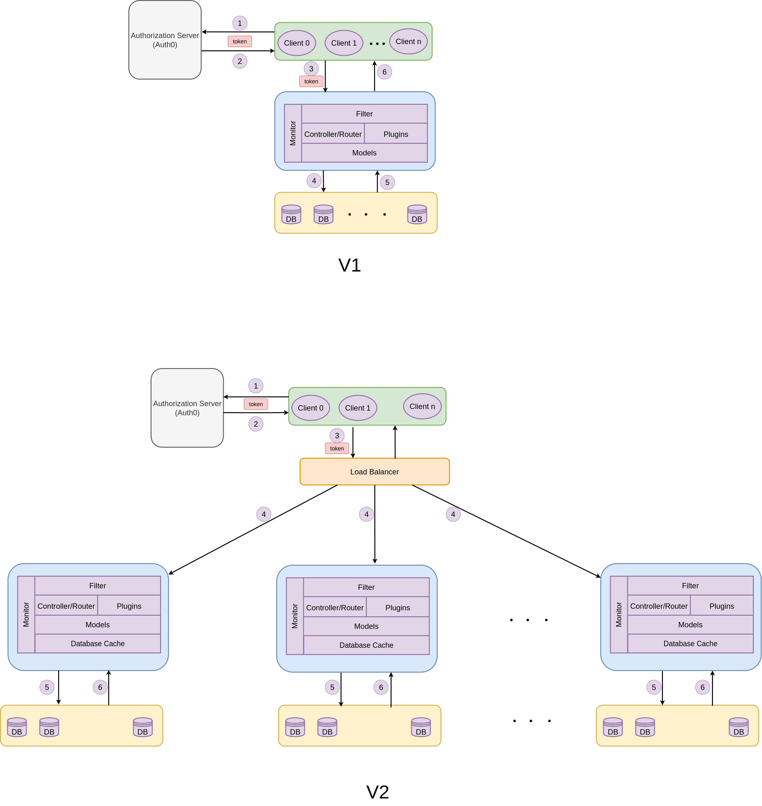

## Introduction

`str-ap` is a modular C++ web API for managing and analyzing short-term rental (STR) data. It leverages the [Drogon](https://github.com/drogonframework/drogon) C++ web framework for HTTP routing, ORM/database, plugin management, and integrates with PostgreSQL databases for persistent storage. JWT-based authentication is supported for secure endpoints.


## Architecture Diagram

[View PDF](resources/str-ap-arch.drawio.pdf)



---
## Main Components
### 1. Controllers

- **STRController**
  - Handle STR-related API requests:
      - `POST /api/v0/str/activity-data`
      - `POST /api/v0/str/listings`
      - `GET /api/v0/str/area`
      - `GET /api/v0/str/area/{id}`
      - `GET /api/v0/str/rotterdam/{unitid}` (JWT-protected)
      - `GET /api/v0/str/amsterdam/{areaid}` (JWT-protected)
  - Validates and processes requests, interacts with service plugins.

- **CAController**
    - Handles CA-related API requests:
        - `GET /api/v0/ca/activity-data`
        - `GET /api/v0/ca/listings`
        - `POST /api/v0/str/area`
- **HealthController**
    - Handles Health-related API requests:
        - `GET /api/v0/ping`


### 2. Plugins/Services 

- **RotterdamService**
    - Plugin for Rotterdam-specific business logic and PostgreSQL access.
    - Handles requests for Rotterdam unit information.

- **AmsterdamService**
    - Plugin for Amsterdam-specific business logic and PostgreSQL access.
    - Handles requests for Amsterdam area information.


### 3. Models

- **Metadata, HandlerActivityData, HandlerStatus, etc.**
    - Define data structures for requests and responses.
    - Include serialization/deserialization (to/from JSON).


### 4. Filters

- **Base64Url.h**
    - Helper utilities for encoding/decoding and cryptographic tasks.
    - Used for JWT authentication and key handling.

---


## Technologies
- **Framework:** [Drogon Web Framework](https://github.com/drogonframework/drogon)
- **Database:** PostgreSQL (separate DBs for Rotterdam and Amsterdam data)
- **Authentication:** JWT (via [jwt-cpp](https://github.com/Thalhammer/jwt-cpp))
- **Build System:** CMake
---

## Request Handling Flow

1. **HTTP Request** enters the Drogon server.
2. **Routing:** Drogon maps the request to the appropriate controller and method based on endpoint/HTTP verb.
3. **Controller Logic:** The controller parses JSON, validates input, and calls into the relevant plugin/service.
4. **Service Plugin:** Handles business logic and interacts with the PostgreSQL database.
5. **Response:** Data is serialized to JSON and returned to the client.

---

## Example Endpoint Implementation

- **Submit STR Activity Data (POST /api/v0/str/activity-data):**
    - Controller parses JSON payload.
    - Validates fields (e.g., `submissionDate`, `unitId`, etc.).
    - Creates an `ActivityData` model and saves it to the database.
    - Returns status to the client.

- **Get Rotterdam Test Info (GET /api/v0/str/rotterdam/{unitid}):**
    - Controller checks JWT (via filter).
    - Calls `RotterdamService::getUserById` to retrieve unit data from the database.
    - Returns results as JSON.

---

## Project Directory Structure

```
controllers/    # API controllers (STRController, CAController)
plugins/        # Service plugins (RotterdamService, AmsterdamService)
models/         # Data models (Metadata, etc.)
filters/        # Filters and helpers (JWT, Base64Url, etc.)
dataType/       # Additional data type definitions
test/           # Tests and test config
```

---

## Security

- **JWT Authentication:** Certain endpoints require valid JWT tokens, validated with public keys using helper functions in `filters/Base64Url.h`.
- **Input Validation:** Controllers validate JSON payloads and required fields before processing.

---

## Extensibility

- **Add New Endpoints:** Implement new methods in controller classes and register routes with `ADD_METHOD_TO`.
- **Add New Services:** Create new plugins following the pattern in `plugins/`.


---
## Prerequisite
---


---
## How to run

---


---
## TODO
- Milestone
  - SDEP AGI Gateway Architecture Design
  - CI/CD
  - Unit Test
  - Docker File
- Implementation
  - Deploy Authorization Server
  - Implement the framework of API Gateway.
    - Controllers
    - Filters
    - Plugins
    - Models
  - Deploy Multi-PostgreSQL
  - Record Test Sample Data
  - implement 2 user stories, including 7 Http requests
    - https://eu-str.sdep-pilot.eu/api/v0/ping
    - https://eu-str.sdep-pilot.eu/api/v0/ca/activity-data
    - https://eu-str.sdep-pilot.eu/api/v0/ca/data-area
    - https://eu-str.sdep-pilot.eu/api/v0/ca/data-area/{luid}
    - https://eu-str.sdep-pilot.eu/api/v0/ca/listings
    - https://eu-str.sdep-pilot.eu/api/v0/ca/str-area
    - https://eu-str.sdep-pilot.eu/api/v0/ca/str-area/{luid}

---
